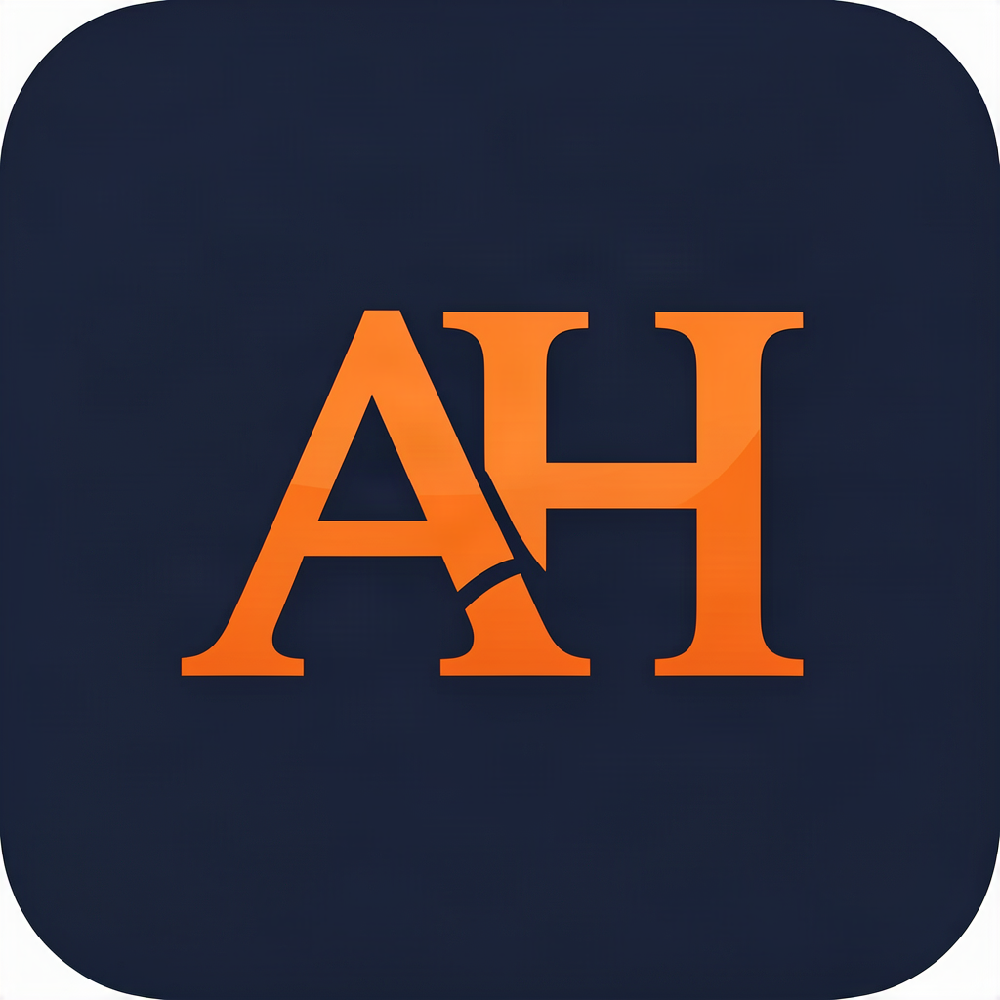
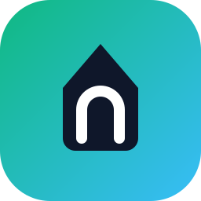

# Ahmed Harb

### Full-Stack Developer · Building private, local-first products

I design and build complete products — premium UI, real data, no shortcuts.
From expense trackers with Telegram bots to 3D streetwear stores and
self-hosted network dashboards.

 

---

## 🚀 Featured Projects

<table>
<tr>
<td align="center" width="33%">

 <b>Finora</b>
 Smart, private expense tracker — 100% local, bilingual (EN/AR), 12 views, local AI assistant & a Telegram bot that understands <i>"i spent 250 for food with cash"</i>.
 
<a href="https://github.com/a7medd7arbb2662/Finora-Expense-Tracker">Repo</a> · <a href="https://finora-expense-tracker-nine.vercel.app">Live</a>
</td>
<td align="center" width="33%">

 <b>HARBWEAR</b>
 Premium streetwear e-commerce platform — cinematic 3D shopping experience, scroll storytelling, immersive animations & a complete fashion branding system.
 
<a href="https://github.com/a7medd7arbb2662/HARBWEAR">Repo</a> · <a href="https://harbwear.vercel.app">Live</a>
</td>
<td align="center" width="33%">

 <b>Offset Coffee</b>
 Bilingual coffee-house brand experience — EN/AR RTL, self-hosted fonts, full brand kit from logo to menu & merch data.
 
Brand & UI project
</td>
</tr>
</table>

### 🧰 More builds

| Project | What it is | Link |
|---|---|---|
| 🧠 AI-Image-Prompt-Generator | Prompt builder for AI image generation | [Repo](https://github.com/a7medd7arbb2662/AI-Image-Prompt-Generator) · [Live](https://ai-image-prompt-generator-ecru.vercel.app) |
| 🧮 Calculator | Clean, responsive calculator | [Repo](https://github.com/a7medd7arbb2662/calculator-ahmedharb) · [Live](https://calculator-ahmedharb.vercel.app) |
| 💸 expense.tracker | Early Finora prototype | [Repo](https://github.com/a7medd7arbb2662/expense.tracker-ahmedharb) · [Live](https://expense-tracker-ahmedharb.vercel.app) |

---

## 📊 GitHub Stats

---

## 🌱 What I'm about

- 🔒 **Privacy-first** — local-first apps, data stays on your machine
- 🌍 **Bilingual by default** — every product ships English + العربية (RTL)
- 🎨 **Premium UI** — dark themes, serif display type, glass & motion
- 🤖 **Bots that do real work** — Telegram bots that parse natural language and save to your data

 
<b>Finora · HARBWEAR · HarbOS</b>
 

**Made By : Ahmed Harb**

